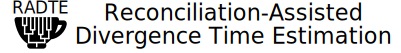
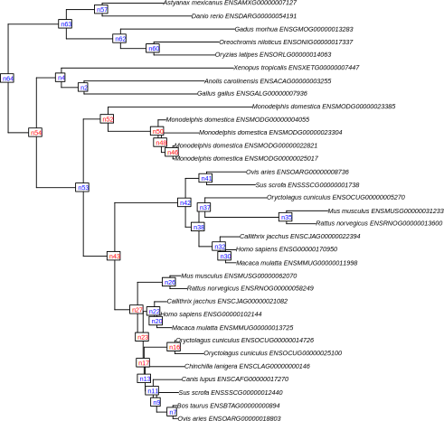
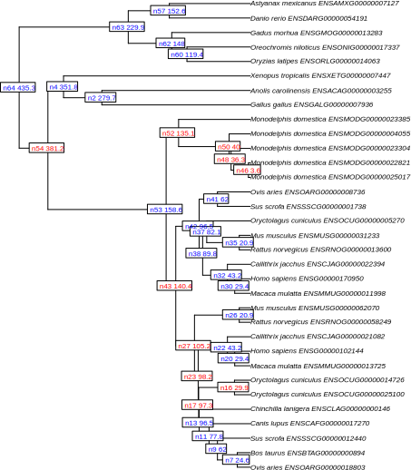
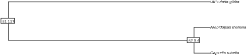
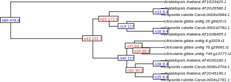

## Overview
**R**econciliation-**A**ssisted **D**ivergence **T**ime **E**stimation (**RADTE** / [rædˈti:](http://ipa-reader.xyz/?text=r%C3%A6d%CB%88ti:&voice=Salli)) is a method to date gene trees with the aid of dated species trees.
This program can handle a rooted gene tree containing duplication/loss events.
The divergence time of duplication nodes are estimated while constraining speciation nodes by transferring the known or pre-estimated divergence time from the species tree to the gene tree.


## Dependency
* [R](https://www.r-project.org/): Started developing with 3.5 and most recently tested with 4.1.
* [ape](http://ape-package.ird.fr/)
* [treeio](https://github.com/YuLab-SMU/treeio): required for `--generax_nhx`

In addition to the above dependencies, RADTE needs an output from a phylogeny reconciliation program. 
**NOTUNG** and **GeneRax** are supported.
* [NOTUNG](http://www.cs.cmu.edu/~durand/Notung/)
* [GeneRax](https://github.com/BenoitMorel/GeneRax)

## Installation
After installing the above dependencies, please download the `radte.r` script by, for example, `git` or `svn`, and change the file permission. 
You can also download a zipped repository from `Code -> Download ZIP` above.
```
# With git
git clone https://github.com/kfuku52/RADTE
cd RADTE

# With svn
svn export https://github.com/kfuku52/RADTE/trunk/radte.r

# Change permission
chmod +x ./radte.r
```

## Options
#### `--species_tree`
Species tree with estimated divergence time.
Leaves (species) should be labeled as `GENUS_SPECIES` (e.g., Homo_sapiens).
The tree is expected to be ultrametric and branch lengths should represent evolutionary time (e.g., million years).
Internal nodes including the root node must be uniquely labeled and the same file should be consistently used for **NOTUNG/GeneRax** and **RADTE**.
Don't know how to label internal nodes? Try this R one-liner.
```
R -q -e "library(ape); t=read.tree('species_tree_noLabel.nwk'); \
t[['node.label']]=paste0('s',1:Nnode(t)); \
write.tree(t, 'species_tree.nwk')"
```
#### `--gene_tree`
Rooted newick tree. Leaves (genes) should be labeled as `GENUS_SPECIES_GENEID` (e.g., Homo_sapiens_ENSG00000102144). The tree is expected to be non-ultrametric and branch lengths should represent substitutions per site. 
Use the tree that **NOTUNG** produces because its internal nodes are correctly labeled in accordance with the **NOTUNG parsable file**, another input for this program.
#### `--notung_parsable`
An output file from **NOTUNG** (tested with version 2.9) can be used to acquire the species–gene relationships in phylogeny reconciliation. See **Examples** for details.
#### `--generax_nhx`
Instead of the **NOTUNG** output, the NHX tree from **GeneRax** can also be used as an input. If specified, `--gene_tree` and `--notung_parsable` will be ignored. See **Examples** for details.
#### `--max_age`
If duplication nodes are deeper than the root node of the species tree, this value will be used as an upper limit of the root node.
#### `--chronos_lambda`
Passed to `chronos` for divergence time estimation. See `chronos` in the [**ape** documentation](https://www.rdocumentation.org/packages/ape/versions/5.2/topics/chronos).
#### `--chronos_model`
Passed to `chronos` for divergence time estimation. See `chronos` in the [**ape** documentation](https://www.rdocumentation.org/packages/ape/versions/5.2/topics/chronos).
#### `--pad_short_edge`
Prohibit dated branches shorter than this value. If detected, the branch length is readjusted by transferring a small portion of branch length from the parent branch.

## Example 1: RADTE after NOTUNG
For input data, see `data/example_notung_01`.
```
# Run NOTUNG in the reconciliation mode
# Don't forget to specify --parsable
java -jar -Xmx2g Notung-2.9.jar \
-s species_tree.nwk \
-g gene_tree.nwk \
--reconcile \
--infertransfers "false" \
--treeoutput newick \
--parsable \
--speciestag prefix \
--maxtrees 1 \
--nolosses \
--outputdir .

# Run RADTE
./radte.r \
--species_tree=species_tree.nwk \
--gene_tree=gene_tree.nwk.reconciled \
--notung_parsable=gene_tree.nwk.reconciled.parsable.txt \
--max_age=1000 \
--chronos_lambda=1 \
--chronos_model=discrete \
--pad_short_edge=0.001
```
#### species_tree.nwk


#### gene_tree.nwk.reconciled


#### radte_gene_tree_output.nwk


## Example 2: RADTE after GeneRax
For input data, see `data/example_generax_01`.
For your own data, please run GeneRax and obtain a `nhx` file for the gene tree.
In Generax, `--rec-model UndatedDTL` may not be compatible with RADTE, so please use `--rec-model UndatedDL`.
```
./radte.r \
--species_tree=species_tree.nwk \
--generax_nhx=gene_tree.nhx \
--max_age=1000 \
--chronos_lambda=1 \
--chronos_model=discrete \
--pad_short_edge=0.001
```

#### species_tree.nwk


#### gene_tree.nhx


#### radte_gene_tree_output.nwk


## Output files
See `data/example_notung_01` and `data/example_generax_01` for example files.

#### radte_gene_tree_output.nwk
This is the main output file of RADTE. Branch lengths represent the estimated evolutionary time.
Node ages represent the estimated divergence time.
The unit of the branch length is the same as that in the input species tree.

#### radte_*.pdf
RADTE generates pdf files for input and output trees in which nodes are colored (see above examples). Red and blue respectively indicate unconstrained and constrained nodes. 
While the divergence time of blue nodes is transferred from the species tree, that of red nodes is estimated.
When the root node is blue, it means the divergence time is either transferred from the species tree or bounded by `--max_age`.

#### radte_calibration_all.tsv
This table contains all identified calibration nodes where the divergence time may be transferred from the species tree to the gene tree.

#### radte_calibration_used.tsv
This table is a subset of `radte_calibration_all.tsv` and contain only calibration nodes that are used to transfer the divergence time.
A part of calibration points may be dropped if the estimation with all available nodes failed.

#### radte_gene_tree.tsv
This table summarizes gene tree nodes. 
In the column `event`, `S` and `D` respectively denote `speciation node` or `duplication node` inferred by Notung or GeneRax.
The root node is indicated as `S(R)` or `D(R)`.
`lower_sp_node` and `upper_sp_node` together indicate which node/branch of the species tree the gene tree node is mapped.

#### radte_species_tree.tsv
This table summarizes species tree nodes. 

#### radte_calibrated_nodes.txt
This file records what types of gene tree nodes are constrained in the divergence time estimation.
RADTE first attempts to constrain all available calibration points transferred from the species tree (**R**, root node; **S**, speciation node) for the divergence time estimation by `chronos` from the **ape** package.
If the estimation succeeded, the content of this file should be **RS**, because both **R** and **S** nodes were used.
If the first estimation failed, the constraints are gradually relaxed until successful estimation is obtained.
As of version 0.2.0, the order of trials is as follows: **RS** -> **S** -> **R**. 
This differs from the method described in Fukushima and Pollock (2020), where duplication nodes (**D**) may be constrained with the upper and lower limits.

## Citation
The prototype of RADTE is described in this publication.

Fukushima K, Pollock DD. 2020. Amalgamated cross-species transcriptomes reveal organ-specific propensity in gene expression evolution. **Nature Communications 11**: 4459 ([DOI: 10.1038/s41467-020-18090-8]( https://doi.org/10.1038/s41467-020-18090-8 ))

## Licensing
This program is MIT-licensed. See [LICENSE](LICENSE) for details.
