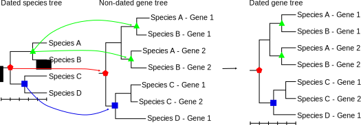
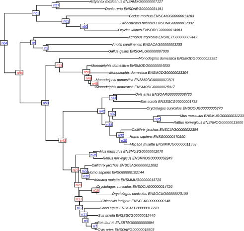
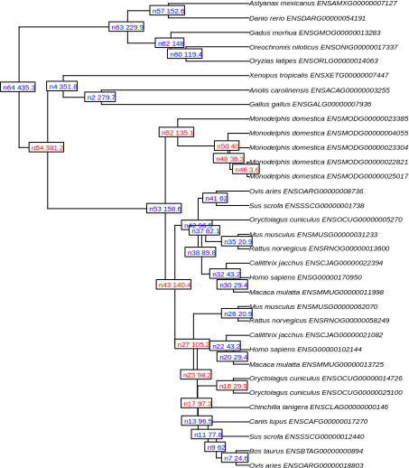
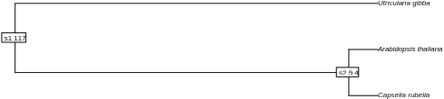
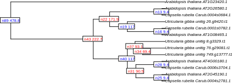

[](https://github.com/kfuku52/RADTE/actions/workflows/radte-ci.yml)
[](https://github.com/kfuku52/RADTE/releases)
[](https://anaconda.org/bioconda/radte)
[](https://www.r-project.org/)
[](https://opensource.org/licenses/MIT)

## Overview
**R**econciliation-**A**ssisted **D**ivergence **T**ime **E**stimation (**RADTE** / [rædˈti:](http://ipa-reader.xyz/?text=r%C3%A6d%CB%88ti:&voice=Salli)) is a method to date gene trees with the aid of dated species trees.
This program can handle a rooted gene tree containing duplication/loss events.
The divergence time of duplication nodes are estimated while constraining speciation nodes by transferring the known or pre-estimated divergence time from the species tree to the gene tree.



## Dependency
* [R](https://www.r-project.org/): Started developing with 3.5 and most recently tested with 4.1.
* [ape](http://ape-package.ird.fr/)
* [treeio](https://github.com/YuLab-SMU/treeio): required for `--generax_nhx`
* [PAML / MCMCTree](http://abacus.gene.ucl.ac.uk/software/paml.html): optional, required for `--dating_backend=mcmctree`

In addition to the above dependencies, RADTE needs an output from a phylogeny reconciliation program. 
**NOTUNG** and **GeneRax** are supported.
* [NOTUNG](http://www.cs.cmu.edu/~durand/Notung/)
* [GeneRax](https://github.com/BenoitMorel/GeneRax)

## Installation
### Option 1: Bioconda (recommended)
RADTE is available on Bioconda.
```
# Direct install into current environment
conda install bioconda::radte
```

### Option 2: Source script (development/latest repository version)
If you want the latest repository code, download the `radte.r` script by, for example, `git` or `svn`, and change the file permission.
You can also download a zipped repository from `Code -> Download ZIP` above.
```
# With git
git clone https://github.com/kfuku52/RADTE
cd RADTE

# With svn
svn export https://github.com/kfuku52/RADTE/trunk/radte.r

# Change permission
chmod +x ./radte.r
```

## Options
#### `--species_tree`
Species tree with estimated divergence time.
By default, leaves (species) should be labeled as `GENUS_SPECIES` (e.g., Homo_sapiens).
If `--species-parser=taxonomic` is used, taxonomically qualified labels such as `Dictyostelium_cf_discoideum` are also accepted.
The tree is expected to be ultrametric and branch lengths should represent evolutionary time (e.g., million years).
Internal nodes including the root node must be uniquely labeled and the same file should be consistently used for **NOTUNG/GeneRax** and **RADTE**.
Don't know how to label internal nodes? Try this R one-liner.
```
R -q -e "library(ape); t=read.tree('species_tree_noLabel.nwk'); \
t[['node.label']]=paste0('s',1:Nnode(t)); \
write.tree(t, 'species_tree.nwk')"
```
#### `--gene_tree`
Rooted newick tree. By default, leaves (genes) should be labeled as `GENUS_SPECIES_GENEID` (e.g., Homo_sapiens_ENSG00000102144).
If `--species-parser` is switched to `taxonomic`, `regex`, or `map`, gene tips are interpreted with that parser instead.
The tree is expected to be non-ultrametric and branch lengths should represent substitutions per site. 
Use the tree that **NOTUNG** produces because its internal nodes are correctly labeled in accordance with the **NOTUNG parsable file**, another input for this program.
#### `--notung_parsable`
An output file from **NOTUNG** (tested with version 2.9) can be used to acquire the species–gene relationships in phylogeny reconciliation. See **Examples** for details.
#### `--generax_nhx`
Instead of the **NOTUNG** output, the NHX tree from **GeneRax** can also be used as an input. If specified, `--gene_tree` and `--notung_parsable` will be ignored. See **Examples** for details.
The NHX species annotation tag `S` is required for all nodes and must match species-tree node labels.
The duplication tag `D` is optional (missing values are treated as non-duplication). Accepted duplication values are `Y`, `YES`, `TRUE`, `T`, `1`; accepted non-duplication values are `N`, `NO`, `FALSE`, `F`, `0`.
#### `--species-parser`
Optional species-label parser. Default is `legacy`.
Supported values are:
* `legacy`: current `GENUS_SPECIES` / `GENUS_SPECIES_GENEID` behavior.
* `taxonomic`: accepts taxonomically qualified species labels such as `Dictyostelium_cf_discoideum_gene123` or `Arabidopsis_thaliana_subsp_lyrata_gene456`.
* `regex`: extracts species labels from gene tips using `--species-regex`.
* `map`: resolves species labels from `--species-map-tsv`.
#### `--species-regex`
Required when `--species-parser=regex`.
RADTE uses the first capture group if the regex contains captures; otherwise it uses the full match as the extracted species label.
#### `--species-map-tsv`
Required when `--species-parser=map`.
This should be a tab-delimited file with `label` and `species` columns.
An optional `taxonomy_query` column can be used to override scientific-name conversion.
#### `--species_node_bounds_tsv`
Optional tab-delimited file for species-tree node age constraints.
This file should contain a `node` column plus either `age` or the pair `age_min` / `age_max`.
The node names must match the labeled internal/root nodes in `--species_tree`.
The point age implied by the species-tree branch lengths must fall within the supplied interval.
RADTE transfers these bounds to gene-tree speciation nodes. If the same species-tree node corresponds to multiple gene-tree speciation nodes, `mcmctree` enforces a shared age parameter, while `chronos` only reuses the same interval bounds.
Accepted examples:
```
node	age
n1	10
root	30
```
or
```
node	age_min	age_max
n1	8	12
root	28	32
```
Use `age` if you want an exact calibration for that species-tree node.
Use `age_min` / `age_max` if you want a confidence interval to be propagated to the corresponding gene-tree speciation nodes.
#### `--max_age`
If duplication nodes are deeper than the root node of the species tree, this value will be used as an upper limit of the root node.
#### `--chronos_lambda`
Passed to `chronos` for divergence time estimation. See `chronos` in the [**ape** documentation](https://www.rdocumentation.org/packages/ape/versions/5.2/topics/chronos).
#### `--chronos_model`
Passed to `chronos` for divergence time estimation. Supported values are `discrete`, `relaxed`, and `correlated`.
If an unsupported value is given (e.g., typo like `difscrete`), RADTE now exits with a clear error and suggestion.
See `chronos` in the [**ape** documentation](https://www.rdocumentation.org/packages/ape/versions/5.2/topics/chronos).
#### `--pad_short_edge`
Prohibit dated branches shorter than this value. If detected, the branch length is readjusted by transferring a small portion of branch length from the parent branch.
#### `--allow_constraint_drop`
`true`/`false` (`1`/`0`, `yes`/`no` are also accepted).  
Default is `true`.
RADTE now first tries to keep all root/speciation constraints by stabilizing conflict-prone bounds.
In this no-drop phase, RADTE also performs multi-seed retries and soft-bound retries (plus alternative `chronos` model/`lambda` trials) to avoid numerical failures.
If these `chronos` retries still fail and `--allow_constraint_drop=false`, RADTE uses a deterministic no-drop fallback (constraint-preserving node dating without dropping calibration nodes).
If this option is `true`, RADTE runs the same exhaustive retry pipeline stage-by-stage while dropping constraints in order (`RS` -> `S` -> `R`), moving to the next stage only after the current stage is exhausted.
Set `--allow_constraint_drop=false` to disable `S/R` drop stages and keep the run strictly no-drop.
#### `--chronos_attempt_timeout_sec`
Per-attempt timeout (seconds) for each `chronos` call.  
Use a non-negative number, or `inf`/`none`/`off` to disable per-attempt timeout.
When `--allow_constraint_drop=false`, RADTE now defaults to `60` seconds to avoid infinite waits and then proceeds to no-drop fallback.
#### `--chronos_total_timeout_sec`
Total timeout budget (seconds) across all `chronos` retries (RS + retry strategies + S/R if enabled).  
Use a non-negative number, or `inf`/`none`/`off` to disable total budgeting.
When `--allow_constraint_drop=false`, RADTE now defaults to `300` seconds.
#### `--dating_backend`
Dating engine. Supported values are `chronos` (default) and `mcmctree`.
`chronos` uses the current `ape::chronos` workflow and supports `--allow_constraint_drop` plus the `--chronos_*` options.
When speciation-node intervals are supplied through `--species_node_bounds_tsv`, `chronos` uses those `age.min` / `age.max` bounds but cannot force separate internal nodes to share one estimated age unless the bounds are exact.
`mcmctree` runs the external **PAML** program **MCMCTree** on the reconciled gene tree using the transferred root/speciation calibrations.
For repeated speciation events caused by ancestral duplications, RADTE uses **MCMCTree** mirror labels (`#1`, `#2`, ...) so that corresponding gene-tree speciation nodes can share the same age parameter.
The current RADTE integration supports `usedata=1` only and requires a MCMCTree-compatible alignment file.
**BEAST is not yet integrated.**
#### `--mcmctree_seqfile`
Required when `--dating_backend=mcmctree`.
This should be an alignment file readable by **MCMCTree** whose taxon names exactly match the gene-tree tip labels.
#### `--mcmctree_bin`
Optional path to the `mcmctree` executable. Default is `mcmctree` in `PATH`.
#### `--mcmctree_workdir`
Optional staging directory for the **MCMCTree** run. RADTE writes the generated tree/control files there and captures `out.txt`, `mcmc.txt`, `FigTree.tre`, and the stdout/stderr logs.
#### `--mcmctree_usedata`
Passed to **MCMCTree** as `usedata`.
The current RADTE integration supports only `1`.
#### `--mcmctree_seqtype`
Passed to **MCMCTree** as `seqtype`. Default is `0`.
#### `--mcmctree_clock`
Passed to **MCMCTree** as `clock`. Default is `2`.
#### `--mcmctree_model`
Passed to **MCMCTree** as `model`. Default is `0`.
#### `--mcmctree_burnin`, `--mcmctree_sampfreq`, `--mcmctree_nsample`, `--mcmctree_ncatG`
Passed to **MCMCTree** as `burnin`, `sampfreq`, `nsample`, and `ncatG`.

## Example 1: RADTE after NOTUNG
For input data, see `data/example_notung_01`.
```
# Run NOTUNG in the reconciliation mode
# Don't forget to specify --parsable
java -jar -Xmx2g Notung-2.9.jar \
-s species_tree.nwk \
-g gene_tree.nwk \
--reconcile \
--infertransfers "false" \
--treeoutput newick \
--parsable \
--speciestag prefix \
--maxtrees 1 \
--nolosses \
--outputdir .

# Run RADTE
./radte.r \
--species_tree=species_tree.nwk \
--gene_tree=gene_tree.nwk.reconciled \
--notung_parsable=gene_tree.nwk.reconciled.parsable.txt \
--max_age=1000 \
--chronos_lambda=1 \
--chronos_model=discrete \
--pad_short_edge=0.001
```
#### species_tree.nwk


#### gene_tree.nwk.reconciled


#### radte_gene_tree_output.nwk


## Example 2: RADTE after GeneRax
For input data, see `data/example_generax_01`.
For your own data, please run GeneRax and obtain a `nhx` file for the gene tree.
In Generax, `--rec-model UndatedDTL` may not be compatible with RADTE, so please use `--rec-model UndatedDL`.
```
./radte.r \
--species_tree=species_tree.nwk \
--generax_nhx=gene_tree.nhx \
--max_age=1000 \
--chronos_lambda=1 \
--chronos_model=discrete \
--pad_short_edge=0.001
```

#### species_tree.nwk


#### gene_tree.nhx


#### radte_gene_tree_output.nwk


## Example 3: transfer species-tree node age CI to gene-tree speciation nodes
Prepare a species-node bounds file.
```
cat > species_node_bounds.tsv <<'EOF'
node	age_min	age_max
s2	8	12
s1	28	32
EOF
```

Run RADTE with the default `chronos` backend.
```
./radte.r \
--species_tree=species_tree.nwk \
--generax_nhx=gene_tree.nhx \
--species_node_bounds_tsv=species_node_bounds.tsv \
--max_age=1000 \
--chronos_lambda=1 \
--chronos_model=discrete \
--pad_short_edge=0.001
```

This transfers the interval for `s2` and `s1` to the corresponding gene-tree speciation nodes.
With `chronos`, repeated speciation nodes created by ancestral duplications receive the same interval bounds, but they are not forced to have exactly identical estimated ages unless the bounds are exact.

Check the transferred constraints in:
* `radte_species_tree.tsv`: branch-length point ages and the effective `age_min` / `age_max`
* `radte_gene_tree.tsv`: transferred `lower_age` / `upper_age`, `constraint_sp_node`, and `shared_speciation_group`

## Example 4: RADTE with the MCMCTree backend
`MCMCTree` requires an alignment file whose taxon labels match the gene-tree tips.
If you use PHYLIP sequential format, separate each taxon name from the sequence by at least two spaces because **MCMCTree** is strict about this.
```
./radte.r \
--species_tree=species_tree.nwk \
--gene_tree=gene_tree.nwk.reconciled \
--notung_parsable=gene_tree.nwk.reconciled.parsable.txt \
--max_age=1000 \
--dating_backend=mcmctree \
--mcmctree_seqfile=gene_alignment.phy \
--mcmctree_clock=2 \
--mcmctree_model=0 \
--mcmctree_burnin=2000 \
--mcmctree_sampfreq=10 \
--mcmctree_nsample=20000
```

To combine `MCMCTree` with species-node CI:
```
./radte.r \
--species_tree=species_tree.nwk \
--generax_nhx=gene_tree.nhx \
--species_node_bounds_tsv=species_node_bounds.tsv \
--max_age=1000 \
--dating_backend=mcmctree \
--mcmctree_seqfile=gene_alignment.phy
```

When the same labeled species-tree node is mapped to multiple gene-tree speciation nodes, RADTE writes **MCMCTree** mirror labels (`#1`, `#2`, ...) so that those nodes share one age parameter.

## Output files
See `data/example_notung_01` and `data/example_generax_01` for example files.

#### radte_gene_tree_output.nwk
This is the main output file of RADTE. Branch lengths represent the estimated evolutionary time.
Node ages represent the estimated divergence time.
The unit of the branch length is the same as that in the input species tree.

#### radte_*.pdf
RADTE generates pdf files for input and output trees in which nodes are colored (see above examples). Red and blue respectively indicate unconstrained and constrained nodes. 
While the divergence time of blue nodes is transferred from the species tree, that of red nodes is estimated.
When the root node is blue, it means the divergence time is either transferred from the species tree or bounded by `--max_age`.

#### radte_calibration_all.tsv
This table contains all identified calibration nodes where the divergence time may be transferred from the species tree to the gene tree.

#### radte_calibration_used.tsv
This table is a subset of `radte_calibration_all.tsv` and contain only calibration nodes that are used to transfer the divergence time.
RADTE first stabilizes risky descendant/ancestor bounds to keep constraints without dropping nodes.
If `--allow_constraint_drop=true` (default), a part of calibration points may still be dropped only when all no-drop attempts fail.

#### radte_gene_tree.tsv
This table summarizes gene tree nodes. 
In the column `event`, `S` and `D` respectively denote `speciation node` or `duplication node` inferred by Notung or GeneRax.
The root node is indicated as `S(R)` or `D(R)`.
`lower_sp_node` and `upper_sp_node` together indicate which node/branch of the species tree the gene tree node is mapped.
`constraint_sp_node` identifies speciation constraints that correspond to a single labeled species-tree node, and `shared_speciation_group` marks repeated speciation nodes that are linked to the same species-tree event.

#### radte_species_tree.tsv
This table summarizes species tree nodes. 
When `--species_node_bounds_tsv` is used, the table also records the transferred `age_min` and `age_max` bounds alongside the branch-length point age.

#### radte_calibrated_nodes.txt
This file records what types of gene tree nodes are constrained in the divergence time estimation.
RADTE first attempts to constrain all available calibration points transferred from the species tree (**R**, root node; **S**, speciation node) for the divergence time estimation by `chronos` from the **ape** package.
If the estimation succeeded, the content of this file should be **RS**, because both **R** and **S** nodes were used.
If you supply `--species_node_bounds_tsv`, RADTE may report **RS** even when the input gene tree has no duplication nodes, because `chronos` needs to run to satisfy interval constraints.
If the first estimation failed, RADTE retries while preserving **RS** by stabilizing risky bounds, edge scaling, multi-seed restarts, and soft-bound/alternative-parameter retries.
If all **RS** retries fail and `--allow_constraint_drop=true`, RADTE repeats the same exhaustive retry pipeline at **S**, then at **R** (order: **RS** -> **S** -> **R**).
This differs from the method described in Fukushima and Pollock (2020), where duplication nodes (**D**) may be constrained with the upper and lower limits.

#### radte_mcmctree_*
When `--dating_backend=mcmctree` is used, RADTE also copies the generated **MCMCTree** artifacts into the output directory with the prefix `radte_mcmctree_` (for example `radte_mcmctree_out.txt`, `radte_mcmctree_mcmc.txt`, `radte_mcmctree_FigTree.tre`, and the generated control/tree files).

## Testing
RADTE includes a comprehensive test suite using `testthat`. To run the tests:
```
# Install test dependencies
Rscript -e 'install.packages(c("testthat", "ape"), repos="https://cloud.r-project.org")'
Rscript -e 'install.packages("BiocManager", repos="https://cloud.r-project.org"); BiocManager::install("treeio")'

# Run tests (default: full)
Rscript test/run_tests.R

# Explicit profiles
RADTE_TEST_PROFILE=full Rscript test/run_tests.R
RADTE_TEST_PROFILE=fast Rscript test/run_tests.R
```

## Citation
The prototype of RADTE is described in this publication.

Fukushima K, Pollock DD. 2020. Amalgamated cross-species transcriptomes reveal organ-specific propensity in gene expression evolution. **Nature Communications 11**: 4459 ([DOI: 10.1038/s41467-020-18090-8]( https://doi.org/10.1038/s41467-020-18090-8 ))

## Licensing
This program is MIT-licensed. See [LICENSE](LICENSE) for details.
