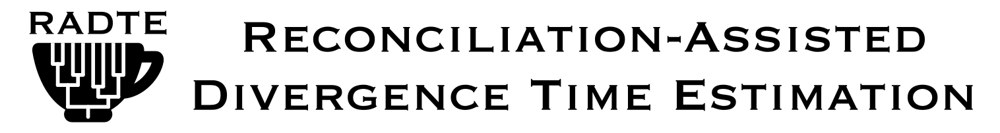
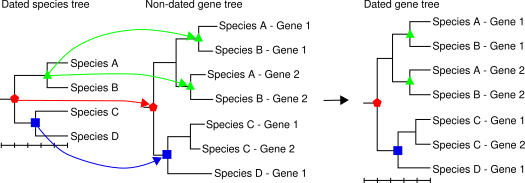

[](https://github.com/kfuku52/RADTE/actions/workflows/radte-ci.yml)
[](https://github.com/kfuku52/RADTE/releases)
[](https://anaconda.org/bioconda/radte)
[](https://www.r-project.org/)
[](https://opensource.org/licenses/MIT)

## Overview
**R**econciliation-**A**ssisted **D**ivergence **T**ime **E**stimation (**RADTE** / [rædˈti:](http://ipa-reader.xyz/?text=r%C3%A6d%CB%88ti:&voice=Salli)) is a method to date gene trees with the aid of dated species trees.
This program can handle a rooted gene tree containing duplication/loss events.
The divergence time of duplication nodes are estimated while constraining speciation nodes by transferring the known or pre-estimated divergence time from the species tree to the gene tree.



## Dependency
* [R](https://www.r-project.org/) 4.3 or later: the CI matrix targets 4.3, 4.4, 4.5, and 4.6.
* [ape](https://cran.r-project.org/package=ape)
* [treeio](https://github.com/YuLab-SMU/treeio): required for `--generax_nhx`
* [PAML / MCMCTree](https://github.com/abacus-gene/paml): optional, required for `--dating_backend=mcmctree`

In addition to the above dependencies, RADTE needs an output from a phylogeny reconciliation program. 
**NOTUNG** and **GeneRax** are supported.
* [NOTUNG](http://www.cs.cmu.edu/~durand/Notung/)
* [GeneRax](https://github.com/BenoitMorel/GeneRax)

## Installation
### Option 1: Source script (latest features)
Clone the repository or download its ZIP archive from `Code -> Download ZIP`. The distributed script is already executable.
```
git clone https://github.com/kfuku52/RADTE
cd RADTE
Rscript -e 'install.packages("ape", repos="https://cloud.r-project.org")'
./radte.r --version
```

See [installation and verification](docs/installation.md) for GeneRax/PAML dependencies, Windows commands, and a real input/output check. Version display alone does not check dependencies.

### Option 2: Bioconda (stable packaged release)
RADTE is also available on Bioconda. The packaged version can lag behind the source version, so check it with `conda list radte` before using recently added options. See the [packaged-release instructions](docs/installation.md#bioconda-packaged-release) for environment setup and matching documentation.
```
conda install bioconda::radte
```

## Quick start

From the repository root, run the bundled NOTUNG example:

```sh
./radte.r \
  --species_tree=data/example_notung_01/species_tree.nwk \
  --gene_tree=data/example_notung_01/gene_tree.nwk.reconciled \
  --notung_parsable=data/example_notung_01/gene_tree.nwk.reconciled.parsable.txt \
  --max_age=1000 --chronos_model=discrete --chronos_lambda=1 \
  --outdir=results --prefix=example --seed=1
```

The dated tree is `results/example_gene_tree_output.nwk`. Tables, plots, and a manifest accompany it. Arguments use `--key=value`; run `./radte.r --help` for all options.

- [Usage, input formats, and worked examples](docs/usage.md)
- [Generated command-line reference](docs/cli-options.md)
- [Calibration, reproducibility, output guarantees, and 0.6 migration](docs/run-contracts.md)
- [Architecture](docs/architecture.md), [contributing](CONTRIBUTING.md), and [releasing](RELEASING.md)

## Development

Edit `R/` modules; `radte.r` is generated. Use `make build`, `make cli-docs`, and `make check` for the usual change loop. Run `make paml` for the full suite with PAML and `make benchmark` for repeated scaling measurements. See [CONTRIBUTING.md](CONTRIBUTING.md) for setup and test boundaries.

## Citation

Fukushima K, Pollock DD. 2020. Amalgamated cross-species transcriptomes reveal organ-specific propensity in gene expression evolution. **Nature Communications 11**: 4459. [DOI: 10.1038/s41467-020-18090-8](https://doi.org/10.1038/s41467-020-18090-8).

## Licensing

MIT. See [LICENSE](LICENSE).
