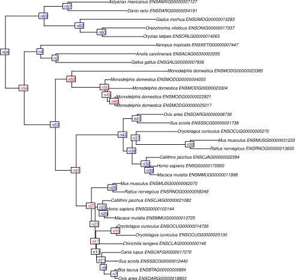
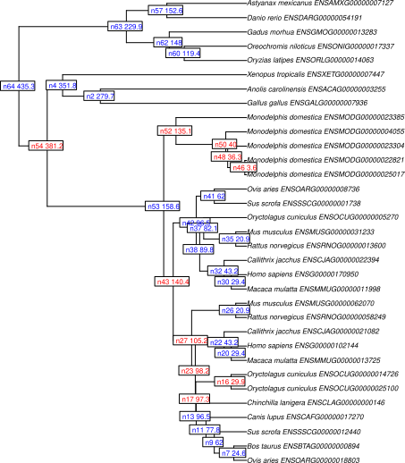
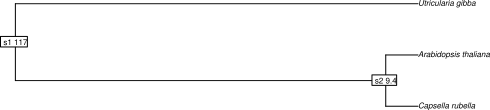
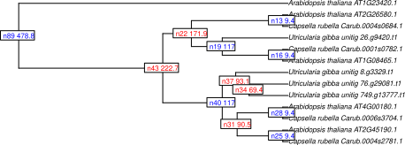
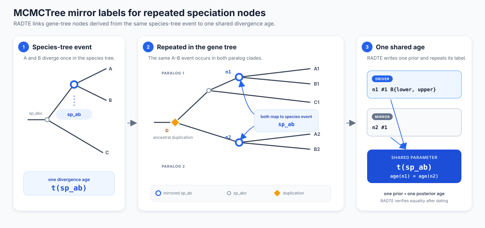

# Usage and examples

Commands assume the repository root and the current source CLI unless an example changes directories. Complete the [installation checks](installation.md) first. Examples 1–3 use bundled inputs and separate output directories; example 4 contains templates requiring your own alignment. See [run contracts and migration notes](run-contracts.md) for calibration, reproducibility, and output guarantees.

## Options
Arguments use `--key=value` syntax. Unknown or duplicated option names are rejected before input processing.
Run `./radte.r --help` for the generated help, or see the complete [command-line reference](cli-options.md). `./radte.r --version` prints the version without loading R packages or input files.

#### `--outdir`, `--prefix`
All artifacts can be directed to one directory with `--outdir` (default: the current directory) and renamed with `--prefix` (default: `radte`). For example, `--outdir=results --prefix=family42` writes `results/family42_gene_tree_output.nwk` and the corresponding tables, plots, and manifest. RADTE creates the output directory when needed, stages the complete run, and publishes its manifest last. A failed writer leaves the previous completed run intact.

#### `--seed`
Base random seed for reproducible `chronos` retries and MCMCTree runs. The default is `1`. The requested and ultimately used seeds are recorded in the run manifest.

#### `--species_tree`
Species tree with estimated divergence time.
By default, leaves (species) should be labeled as `GENUS_SPECIES` (e.g., Homo_sapiens).
If `--species-parser=taxonomic` is used, taxonomically qualified labels such as `Dictyostelium_cf_discoideum` are also accepted.
The tree is expected to be ultrametric and branch lengths should represent evolutionary time (e.g., million years).
Internal nodes including the root node must be uniquely labeled and the same file should be consistently used for **NOTUNG/GeneRax** and **RADTE**.
Don't know how to label internal nodes? Try this R one-liner.
```
R -q -e "library(ape); t=read.tree('species_tree_noLabel.nwk'); \
t[['node.label']]=paste0('s',1:Nnode(t)); \
write.tree(t, 'species_tree.nwk')"
```
#### `--gene_tree`
Rooted newick tree. By default, leaves (genes) should be labeled as `GENUS_SPECIES_GENEID` (e.g., Homo_sapiens_ENSG00000102144).
If `--species-parser` is switched to `taxonomic`, `regex`, or `map`, gene tips are interpreted with that parser instead.
The tree is expected to be non-ultrametric and branch lengths should represent substitutions per site.
Use the tree that **NOTUNG** produces because its internal nodes are correctly labeled in accordance with the **NOTUNG parsable file**, another input for this program.
#### `--notung_parsable`
An output file from **NOTUNG** (tested with version 2.9) can be used to acquire the species–gene relationships in phylogeny reconciliation. See **Examples** for details.
#### `--generax_nhx`
Instead of the **NOTUNG** output, the NHX tree from **GeneRax** can also be used as an input. In GeneRax mode, `--gene_tree` is ignored and `--notung_parsable` must not be specified. See **Examples** for details.
The NHX species annotation tag `S` is required for all nodes and must match species-tree node labels.
The duplication tag `D` is optional (missing values are treated as non-duplication). Accepted duplication values are `Y`, `YES`, `TRUE`, `T`, `1`; accepted non-duplication values are `N`, `NO`, `FALSE`, `F`, `0`.
#### `--species-parser`
Optional species-label parser. Default is `legacy`.
Supported values are:
* `legacy`: current `GENUS_SPECIES` / `GENUS_SPECIES_GENEID` behavior.
* `taxonomic`: accepts taxonomically qualified species labels such as `Dictyostelium_cf_discoideum_gene123` or `Arabidopsis_thaliana_subsp_lyrata_gene456`.
* `regex`: extracts species labels from gene tips using `--species-regex`.
* `map`: resolves species labels from `--species-map-tsv`.
#### `--species-regex`
Required when `--species-parser=regex`.
RADTE uses the first capture group if the regex contains captures; otherwise it uses the full match as the extracted species label.
#### `--species-map-tsv`
Required when `--species-parser=map`.
This should be a tab-delimited file with `label` and `species` columns.
An optional `taxonomy_query` column can be used to override scientific-name conversion.
#### `--species_node_bounds_tsv`
Optional tab-delimited file for species-tree node age constraints.
This file should contain a `node` column plus either `age` or the pair `age_min` / `age_max`.
The node names must match the labeled internal/root nodes in `--species_tree`.
The point age implied by the species-tree branch lengths must fall within the supplied interval.
RADTE transfers these bounds to gene-tree speciation nodes. If the same species-tree node corresponds to multiple gene-tree speciation nodes, `mcmctree` enforces a shared age parameter, while `chronos` only reuses the same interval bounds.
Accepted examples:
```
node	age
n1	10
root	30
```
or
```
node	age_min	age_max
n1	8	12
root	28	32
```
Use `age` for a point calibration or `age_min` / `age_max` for interval bounds. Chronos treats retained bounds as hard constraints. MCMCTree represents them as soft priors, including a narrow interval for a point age; neither backend turns the input interval into an estimated confidence or credible interval. See [calibration semantics](run-contracts.md#calibration-semantics).
#### `--max_age`
If duplication nodes are deeper than the root node of the species tree, this value will be used as an upper limit of the root node.
#### `--chronos_lambda`
Passed to `chronos` for divergence time estimation. See the [**ape** package](https://cran.r-project.org/package=ape), or run `help("chronos", package="ape")` in R for the documentation matching your installed version.
#### `--chronos_model`
Passed to `chronos` for divergence time estimation. Supported values are `discrete`, `relaxed`, and `correlated`.
If an unsupported value is given (e.g., typo like `difscrete`), RADTE now exits with a clear error and suggestion.
See `help("chronos", package="ape")` in R for the documentation matching your installed version.
#### `--pad_short_edge`
Optional positive threshold; unset by default. During input processing, gene-tree branches shorter than this value are raised to it, in the gene tree's substitution-per-site units. Species-tree branch lengths and calibration ages are not padded.

With chronos, the same numeric threshold also sets a minimum on output branches, in the species tree's time units. If needed, RADTE adjusts node ages within the original retained calibration bounds while preserving existing inferred ages where feasible. It fails if the requested minimum cannot satisfy those bounds. This is not unrestricted redistribution from a parent branch; the manifest records `branch_padding_applied`.

MCMCTree receives the input preprocessing, but its posterior output is not padded and has no minimum-branch-length guarantee from this option. Consider the different input/output units when choosing a threshold.
#### `--allow_constraint_drop`
Default: `true`. Within each chronos control profile, RADTE tries RS (root and non-root speciation constraints), then S-only, then R-only after failures. It completes this sequence with the fast profile before considering the high-cost profile. A fast S or R success ends the search without attempting high-cost RS. Original ranges are never changed.

Set this to `false` when every RS constraint must be retained. Only RS is tried in each enabled profile; a deterministic feasible tree may be returned if numerical optimization fails. The manifest identifies that construction, which is not an optimizer estimate. Infeasible input is always an error. MCMCTree ignores this option.

#### `--chronos_attempt_timeout_sec`
Per-attempt timeout (seconds) for each `chronos` call.
Use a positive number; `0` or `inf`/`none`/`off` disables the per-attempt timeout.
Default is `60` seconds and applies to both the fast and high-cost profiles.
Every attempt receives the smaller of this timeout and the remaining `--chronos_total_timeout_sec` budget. Unix runs use a child process that RADTE terminates on timeout. Windows uses R's `setTimeLimit()`, which checks elapsed time only at interrupt points; compiled code can overrun the requested limit. See [R's time-limit documentation](https://stat.ethz.ch/R-manual/R-devel/library/base/html/setTimeLimit.html).
#### `--chronos_total_timeout_sec`
Total timeout budget (seconds) across all `chronos` retries (RS + retry strategies + S/R if enabled).
Use a positive number; `0` or `inf`/`none`/`off` disables total budgeting.
Default is `300` seconds. This budgets chronos retries, not input processing, deterministic construction, or output publication. The Windows interrupt limitation above applies to this budget too; it is not a guaranteed whole-command deadline. When `--allow_constraint_drop=false`, exhausting the budget proceeds to the deterministic no-drop fallback.
#### `--chronos_iter_max`, `--chronos_eval_max`, `--chronos_dual_iter_max`
Controls the initial fast `ape::chronos` optimization profile. Defaults are `250`, `250`, and `20`.
RADTE tries all calibration/model/seed strategies with this bounded profile first, avoiding long waits on numerically unproductive attempts.
#### `--chronos_high_control_fallback`
Boolean; default is `true`.
If every enabled fast-profile stage fails, RADTE repeats the enabled stages with the historical high-cost limits (`iter.max=100000`, `eval.max=100000`, `dual.iter.max=200`) using the remaining total timeout budget. When constraint dropping is enabled, the order is fast RS → S → R, then high-cost RS → S → R, stopping on success or budget exhaustion. With constraint dropping disabled, it is fast RS, then high-cost RS.
Set this to `false` to disable the high-cost fallback.
#### `--dating_backend`
Dating engine. Supported values are `chronos` (default) and `mcmctree`.
`chronos` uses the current `ape::chronos` workflow and supports `--allow_constraint_drop` plus the `--chronos_*` options.
When speciation-node intervals are supplied through `--species_node_bounds_tsv`, `chronos` uses those `age.min` / `age.max` bounds but cannot force separate internal nodes to share one estimated age unless the bounds are exact.
`mcmctree` runs the external **PAML** program **MCMCTree** on the reconciled gene tree using the transferred root/speciation calibrations.
For repeated speciation events caused by ancestral duplications, RADTE uses **MCMCTree** mirror labels (`#1`, `#2`, ...) so that corresponding gene-tree speciation nodes can share the same age parameter.
Both backends preserve the original calibration table and reject temporally infeasible input. MCMCTree also rejects incomplete or inconsistent mirror groups. Its emitted calibrations are PAML soft priors (exact ages use narrow intervals); see [run contracts](run-contracts.md).
After MCMCTree finishes, RADTE independently recalculates every mirrored node age from the posterior mean time tree and stops if members of a shared group differ beyond numerical tolerance.
The current RADTE integration supports `usedata=1` only and requires a MCMCTree-compatible alignment file.
**BEAST is not yet integrated.**
#### `--mcmctree_seqfile`
Required when `--dating_backend=mcmctree`.
This should be an alignment file readable by **MCMCTree** whose taxon names exactly match the gene-tree tip labels.
#### `--mcmctree_bin`
Optional path to the `mcmctree` executable. Default is `mcmctree` in `PATH`.
#### `--mcmctree_workdir`
Optional staging directory for the **MCMCTree** run. RADTE writes the generated tree/control files there and captures `out.txt`, `mcmc.txt`, `FigTree.tre`, and the stdout/stderr logs. By default each invocation receives a unique directory under `--outdir` whose name starts with `<prefix>_mcmctree_run_` and ends with a suffix generated by R's `tempfile()`. Do not parse the suffix as a timestamp or PID; read the actual `mcmctree_workdir` path from the run manifest. Concurrent default workdirs do not share scratch files.
#### `--mcmctree_timeout_sec`
Wall-time limit for the external MCMCTree process. The default is unlimited. A timed-out process fails with an explicit diagnostic while preserving its isolated work directory for inspection.
#### `--mcmctree_usedata`
Passed to **MCMCTree** as `usedata`.
The current RADTE integration supports only `1`.
#### `--mcmctree_seqtype`
Passed to **MCMCTree** as `seqtype`. Default is `0`.
#### `--mcmctree_clock`
Passed to **MCMCTree** as `clock`. Default is `2`.
#### `--mcmctree_model`
Passed to **MCMCTree** as `model`. Default is `0`.
#### `--mcmctree_burnin`, `--mcmctree_sampfreq`, `--mcmctree_nsample`, `--mcmctree_ncatG`
Passed to **MCMCTree** as `burnin`, `sampfreq`, `nsample`, and `ncatG`.

## Example 1: RADTE after NOTUNG
The [bundled NOTUNG inputs](../data/example_notung_01) already include a reconciled tree and parsable metadata; you do not need Java or NOTUNG to run this example. From the repository root:

```sh
./radte.r \
--species_tree=data/example_notung_01/species_tree.nwk \
--gene_tree=data/example_notung_01/gene_tree.nwk.reconciled \
--notung_parsable=data/example_notung_01/gene_tree.nwk.reconciled.parsable.txt \
--max_age=1000 \
--chronos_lambda=1 \
--chronos_model=discrete \
--pad_short_edge=0.001 \
--outdir=results/notung --prefix=radte --seed=1
```

The output tree is `results/notung/radte_gene_tree_output.nwk`. The figures below are historical illustrations from before 0.6.0, not numerical references for the current algorithm; use a fresh run for current ages and tables.
#### species_tree.nwk


#### gene_tree.nwk.reconciled


#### radte_gene_tree_output.nwk


### Reconcile your own data with NOTUNG

This is a template, not a prerequisite for the bundled example. Replace `/path/to/` with your JAR and input locations. Label the species tree before reconciliation and use that same tree in RADTE. Keep `--parsable`, and direct NOTUNG output to a separate directory:

```sh
mkdir -p results/notung-reconciliation
java -jar -Xmx2g /path/to/Notung-2.9.jar \
-s /path/to/species_tree.nwk \
-g /path/to/gene_tree.nwk \
--reconcile \
--infertransfers "false" \
--treeoutput newick \
--parsable \
--speciestag prefix \
--maxtrees 1 \
--nolosses \
--outputdir results/notung-reconciliation
```

Pass the produced reconciled tree and parsable file to `--gene_tree` and `--notung_parsable`, respectively. Do not mix node labels or reconciliation files from different species-tree exports.

## Example 2: RADTE after GeneRax
Use the [bundled GeneRax inputs](../data/example_generax_01) and install treeio as described in [installation](installation.md#generax-input).
For your own data, please run GeneRax and obtain a `nhx` file for the gene tree.
In Generax, `--rec-model UndatedDTL` may not be compatible with RADTE, so please use `--rec-model UndatedDL`.
```sh
./radte.r \
--species_tree=data/example_generax_01/species_tree.nwk \
--generax_nhx=data/example_generax_01/gene_tree.nhx \
--max_age=1000 \
--chronos_lambda=1 \
--chronos_model=discrete \
--pad_short_edge=0.001 \
--outdir=results/generax --prefix=radte --seed=1
```

The output tree is `results/generax/radte_gene_tree_output.nwk`. These figures, like the NOTUNG figures, are historical illustrations rather than expected current numerical output.

#### species_tree.nwk


#### gene_tree.nhx


#### radte_gene_tree_output.nwk


## Example 3: transfer species-tree node age bounds
The following tab-delimited input is already included as [species_node_bounds.tsv](../data/example_generax_01/species_node_bounds.tsv). No new file needs to be created:

```
node	age_min	age_max
s2	8	12
s1	110	125
```

Run RADTE with the default `chronos` backend.
```sh
./radte.r \
--species_tree=data/example_generax_01/species_tree.nwk \
--generax_nhx=data/example_generax_01/gene_tree.nhx \
--species_node_bounds_tsv=data/example_generax_01/species_node_bounds.tsv \
--max_age=1000 \
--chronos_lambda=1 \
--chronos_model=discrete \
--pad_short_edge=0.001 \
--outdir=results/generax-interval --prefix=radte --seed=1
```

This transfers the interval for `s2` and `s1` to the corresponding gene-tree speciation nodes.
With `chronos`, repeated speciation nodes created by ancestral duplications receive the same interval bounds, but they are not forced to have exactly identical estimated ages unless the bounds are exact.

Check the transferred constraints under `results/generax-interval/`:

* `radte_species_tree.tsv`: branch-length point ages and the effective `age_min` / `age_max`
* `radte_gene_tree.tsv`: transferred `lower_age` / `upper_age`, `constraint_sp_node`, and `shared_speciation_group`

## Example 4: RADTE with the MCMCTree backend
The commands below are **templates**: install PAML and replace the `/path/to/` alignment paths with your own files. No alignment is bundled for these example gene trees. `MCMCTree` requires alignment taxon labels to exactly match the corresponding gene-tree tips; the NOTUNG and GeneRax fixtures need different alignments.
If you use PHYLIP sequential format, separate each taxon name from the sequence by at least two spaces because **MCMCTree** is strict about this.
```sh
./radte.r \
--species_tree=data/example_notung_01/species_tree.nwk \
--gene_tree=data/example_notung_01/gene_tree.nwk.reconciled \
--notung_parsable=data/example_notung_01/gene_tree.nwk.reconciled.parsable.txt \
--max_age=1000 \
--dating_backend=mcmctree \
--mcmctree_seqfile=/path/to/notung_gene_alignment.phy \
--mcmctree_clock=2 \
--mcmctree_model=0 \
--mcmctree_burnin=2000 \
--mcmctree_sampfreq=10 \
--mcmctree_nsample=20000 \
--outdir=results/mcmctree-notung --prefix=radte --seed=1
```

To combine `MCMCTree` with species-node interval priors:

```sh
./radte.r \
--species_tree=data/example_generax_01/species_tree.nwk \
--generax_nhx=data/example_generax_01/gene_tree.nhx \
--species_node_bounds_tsv=data/example_generax_01/species_node_bounds.tsv \
--max_age=1000 \
--dating_backend=mcmctree \
--mcmctree_seqfile=/path/to/generax_gene_alignment.phy \
--outdir=results/mcmctree-generax --prefix=radte --seed=1
```

When the same labeled species-tree node is mapped to multiple gene-tree speciation nodes, RADTE writes **MCMCTree** mirror labels (`#1`, `#2`, ...) so that those nodes share one age parameter.
Only one member (the `driver`) receives the calibration prior in the generated MCMCTree tree; the remaining `mirror` members reuse it through their common mirror label.



The ancestral duplication in this schematic produces two gene-tree nodes for the same `sp_ab` species-tree event. RADTE emits the calibration prior once at the `driver` node and assigns the same mirror label to both nodes, making their estimated ages identical. The schematic labels are independent of the bundled input fixtures.

## Output files
The [NOTUNG reference output](../data/example_notung_01/expected) and [GeneRax reference output](../data/example_generax_01/expected) are historical illustrations from before 0.6.0. They retain older table schemas and calibration values and must not be used as numerical expectations for the current algorithm. Run examples 1–3 for current output. Tests likewise generate fresh artifacts in temporary directories instead of modifying these fixtures.

Every filename below starts with the selected `--prefix`; `radte` is shown as the default.

#### radte_gene_tree_output.nwk
This is the main output file of RADTE. Branch lengths represent the estimated evolutionary time.
Node ages represent the estimated divergence time.
The unit of the branch length is the same as that in the input species tree.

#### radte_gene_tree_input.pdf, radte_gene_tree_output.pdf
Blue nodes have a retained calibration; red nodes have no directly retained calibration. Blue does not necessarily mean that the estimated age equals a point age from the species tree. Chronos fixes retained point ages within numerical tolerance, but estimates interval-calibrated ages inside their bounds. MCMCTree uses soft priors, including shared priors for mirrors, so blue nodes can also have estimated ages outside nominal prior bounds. A blue duplication root can use `--max_age` as its nominal upper calibration bound.

The input gene PDF shows substitution branch lengths after any requested input padding. The output gene PDF shows inferred time branch lengths. `radte_species_tree.pdf` shows the dated species tree without the gene-calibration red/blue classification.

#### radte_calibration_all.tsv
This table contains calibration metadata for all internal gene-tree nodes, including non-root duplication intervals that are not selected as dating constraints.

#### radte_calibration_used.tsv
This table lists the retained calibration nodes. It uses the same node IDs and original bounds as `radte_calibration_all.tsv`; its retained root event is labeled `R` rather than `S(R)` or `D(R)`.
With the MCMCTree backend, `shared_speciation_group` identifies cross-braced nodes, `mirror_role` distinguishes the `driver` from its `mirror` nodes, and `prior_emitted` records whether a calibration prior was written at that node in the generated MCMCTree tree.
With the chronos backend, RADTE preserves the original hard bounds and validates estimated ages against every retained constraint. Temporally infeasible input is rejected before inference.
If `--allow_constraint_drop=true` (default), calibrations may be dropped after RS fails within the current control profile, before high-cost RS is attempted. Use `false` to retain every RS constraint.

Both calibration tables also record `estimated_age`, `within_original_bounds`, `constraint_status`, and `bound_policy`; see [run contracts](run-contracts.md). Node numbers refer to the output gene tree as well as the input gene tree.

#### radte_shared_speciation_ages.tsv
This file is written by the MCMCTree backend. It reports each shared species-tree event, its gene-tree member nodes, and consistency checks on their ages in a single posterior mean time tree. `posterior_mean`, `posterior_min`, and `posterior_max` are the mean/minimum/maximum **across member nodes of that group**, not across MCMC samples. They are not confidence or credible intervals and do not measure posterior uncertainty. `max_member_age_diff` and `tolerance` describe the final mirror-equality check; that check does not establish MCMC convergence.

#### radte_gene_tree.tsv
This table summarizes gene tree nodes.
In the column `event`, `S` and `D` respectively denote `speciation node` or `duplication node` inferred by Notung or GeneRax.
The root node is indicated as `S(R)` or `D(R)`.
`lower_sp_node` and `upper_sp_node` together indicate which node/branch of the species tree the gene tree node is mapped.
`constraint_sp_node` identifies speciation constraints that correspond to a single labeled species-tree node, and `shared_speciation_group` marks repeated speciation nodes that are linked to the same species-tree event.

#### radte_species_tree.tsv
This table summarizes species tree nodes.
The table records `age_min` and `age_max` alongside the branch-length point age. Without `--species_node_bounds_tsv`, both bounds equal the point age.

#### radte_calibrated_nodes.txt
This file records what types of gene tree nodes are constrained in the divergence time estimation.

| Value | Backend | Meaning |
| --- | --- | --- |
| `allS` | chronos | No duplication events or species-node intervals are present. One gene per represented species and the same pruned topology are required. Ages are transferred onto the gene tree without calling chronos. |
| `RS` | chronos or MCMCTree | Root and all available non-root speciation calibrations are retained. MCMCTree always reports this class and uses soft priors. |
| `S` | chronos | Only non-root speciation calibrations are retained after a constraint-drop fallback. |
| `R` | chronos | Only the root calibration is retained after a constraint-drop fallback. |

Species-node intervals require chronos inference even without duplication events, so those runs can report `RS`, `S`, or `R` rather than `allS`. With `--allow_constraint_drop=false`, all inferred chronos outputs retain `RS`; a deterministic construction also reports `RS`, so inspect `chronos_model_used` in the manifest to distinguish it from optimization.

Within each control profile, chronos retries use edge scaling, multi-seed restarts, and alternative model/lambda parameters without widening or softening retained bounds. When constraint dropping is enabled, the complete order is fast **RS → S → R**, then high-cost **RS → S → R** if enabled and budget remains. Each successful stage ends the search. With dropping disabled, only RS is tried in each profile before the deterministic fallback.
This differs from the method described in Fukushima and Pollock (2020), where duplication nodes (**D**) may be constrained with the upper and lower limits.

#### radte_mcmctree_*
When `--dating_backend=mcmctree` is used, RADTE also copies the generated **MCMCTree** artifacts into the output directory with the prefix `radte_mcmctree_` (for example `radte_mcmctree_out.txt`, `radte_mcmctree_mcmc.txt`, `radte_mcmctree_FigTree.tre`, and the generated control/tree files).

#### radte_run_manifest.tsv
An audit record written after a successful run. It includes the RADTE, R, `ape`, and `treeio` versions; start/end timestamps; effective options including defaults; dating backend and effective parameters; requested/effective seeds; output location; MCMCTree executable/banner/work directory when applicable; and SHA-256 hashes of input and output files, run ID, completion status, RNG kind, and calibration policy.
